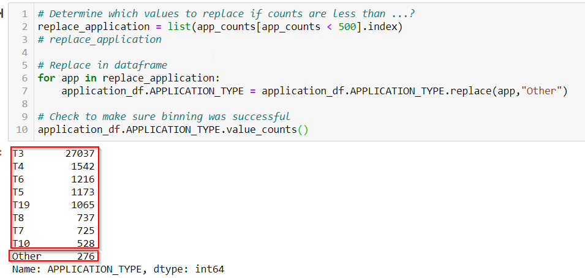
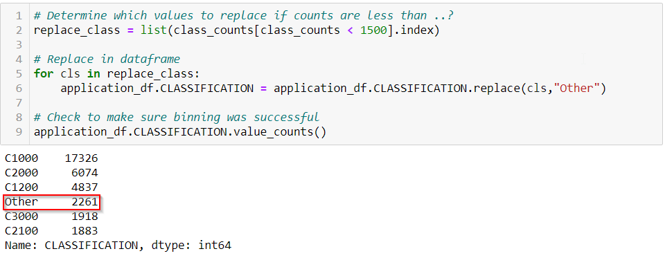
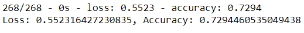
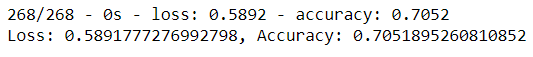
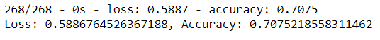
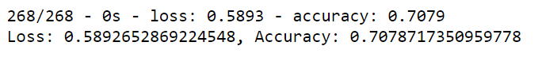
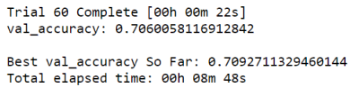

# Overview of Neural Network Charity Analysis


### Machine learning and neural networks will be used for the provided dataset to help create a binary classifier that is capable of predicting whether applicants will be successful if funded by Alphabet Soup. The neural network results will be saved in an HDF5 file. After the first run the model will be attempted to be optimized 3 different ways to increase the accuracy of the model.

<br/>

## Results: Data Preprocessing

<br/>

-   What variable(s) are considered the target(s) for your model? 

    #### The binary variable "IS_SUCCESSFUL" is the target feature for the model. So the model wil be predicting if the money was used effectively.

``` python
    y = application_df["IS_SUCCESSFUL"].values
```

-   What variable(s) are considered to be the features for your model? 

    #### The feature variables under consideration for the model are APPLICATION_TYPE, AFFILLIATION, ClASSIFICATION, USE_CASE, ORGANIZATION, STATUS, INCOME_AMT, SPECIAL_CONSIDERATIONS, and ASK_AMT.

    #### The two columns with more than 10 categories (APPLICATION_TYPE and CLASSIFICATION) were binned into fewer categories.

<br/>

-   APPLICATION_TYPE categories

     

<br/>

-   CLASSIFICATION categories
 

<br/>

-   What variable(s) are neither targets nor features, and should be removed from the input data? 

    #### The variables EIN and NAME are not considered as features or targets. They are names and ID's that don't add any information as to whether the money use is successful.

<br/>

## Results: Compiling, Training, and Evaluating the Model

<br/>

-   How many neurons, layers, and activation functions did you select for your neural network model, and why?

    #### The number of neurons for the initial model is 80 for the first hidden layer and 30 for the second hidden layer. This was a starting point based on the number of input features after using OneHotEncoder to transform the categorical variables. The most common activation function was 'relu' so that was used as the starting function. The output function used was 'sigmoid' which is a common starting point in the Module.

```python
    # Define the model - deep neural net, i.e., the number of input features and hidden nodes for each layer.
    number_input_features = len(X_train[0])
    hidden_nodes_layer1 = 80
    hidden_nodes_layer2 = 30

    # First hidden layer
    nn.add(tf.keras.layers.Dense(units=hidden_nodes_layer1, input_dim=number_input_features, 
                          activation="relu"))

    # Second hidden layer
    nn.add(tf.keras.layers.Dense(units=hidden_nodes_layer2, activation="relu"))

    # Output layer
    nn.add(tf.keras.layers.Dense(units=1, activation="sigmoid"))
```

-   Were you able to achieve the target model performance (75% accuracy)?

    #### The target perfomance was not achieved.

<br/>

-   Deliverable 2: model achieved 72.9% accuracy.

     

<br/>

-   Deliverable 3: 1st changed model achieved 70.5% accuracy.

     

<br/>

-   Deliverable 3: 2nd changed model achieved 70.7% accuracy.

     

<br/>

-   Deliverable 3: 3rd changed model achieved 70.8% accuracy.

        


-   What steps did you take to try and increase model performance? 

    #### Here are the steps I took after the inital model run:
    1. I thought to make the model run better with less variance it would be good to cut down on the binning for APPLICATION_TYPE and CLASSIFICATION. It changed both of these into binary variables with the largest category vs other. The other paramenters remained the same as in Deliverable 2. The accuracy didn't improve: 70.5%

    <br/>

    2. So to try to improve the model performance for the second try I kept the binary binning of attempt 1. For this attempt I changed the activation function from relu to tanh that might account for a different shape of the data. The accuracy performed only slightly better: 70.7%.
    
    <br/>

    3. For the third attempt I kept the previous changes and added to them. Here are the other changes: one more hidden layer was added, the number of neurons was lowered, and the number of epochs in the training layer was increased. The accuracy performed only slightly better: 70.8%.

    <br/>

    4. I then tried a fourth attempt that Farshad demonstrated during class using keras tuner. It contains a function that loops through numbers of neurons as well as 4 different activation functions for the hidden layers. The code is saved in a jupyter notebook in this GitHub link "AlphabetSoupCharity_Optimzation-TestTunerCode.ipynb". Below is the function. Even with this more complex method to choose neurons, hidden layes and epochs the accuracy and performance was still not great at 70.6%: 
   
<br/>

 

<br/>


```python
    # Create a method that creates a new Sequential model with hyperparameter options
    def create_model(hp):
            nn_model = tf.keras.models.Sequential()

        # Allow kerastuner to decide which activation function to use in hidden layers
        activation = hp.Choice('activation',['relu','tanh','sigmoid'])
    
        # Allow kerastuner to decide number of neurons in first layer
        nn_model.add(tf.keras.layers.Dense(units=hp.Int('first_units',
            min_value=50,
            max_value=100,
            step=2), activation=activation, input_dim=len(X_train[0])))

        # Allow kerastuner to decide number of hidden layers and neurons in hidden layers
        for i in range(hp.Int('num_layers', 1, 8)):
            nn_model.add(tf.keras.layers.Dense(units=hp.Int('units_' + str(i),
                min_value=1,
                max_value=30,
                step=2),
                activation=activation))
    
        nn_model.add(tf.keras.layers.Dense(units=1, activation="sigmoid"))

        # Compile the model
        nn_model.compile(loss="binary_crossentropy", optimizer='adam', metrics=["accuracy"])
    
    return nn_model
```

<br/>

## Summary
#### Overall the binary classifier model that was used to predict whether applicants will be successful if funded by Alphabet Soup did not perform as well as I had hoped. The initial model and the four other attempts did not improve the performance. The attempts included different binning of two of the variables with more than 10 classes. Other model modifications included varying the number of neurons per layer, varying the number of hidden layers, and changing the number of epochs. The best model only achieved 72.9% accuracy. 


#### There may be other things to change to optimize the deep neural network model. There is a variable "INCOME_AMT" that is categorical. It has a lot of information but because it's not numeric it doesn't add much. It would be better if the data could include actual income amount as a numeric field. I would consider looking at the correlation of every variable with the IS_SUCCESSFUL target variable. This may give more information in the decision about whether to include them in the model. Maybe the model could be run in a stepwise manner adding one variable at a time in the order of highest correlations. This may give some insight as to variables that are extraneous in the model performance. Maybe the ASK_AMT variable could be dichotomized for amounts=5000 and all others. 